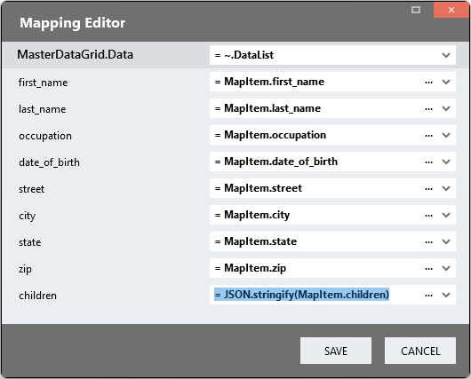

# Master Detail DataGrids <!-- omit in toc -->

This module provides for the display of two related DataGrids, a Master DataGrid and a Details DataGrid. It provides users with a way to scan parent records to locate a set of related child records.

https://github.com/user-attachments/assets/da6dd924-2211-4ea4-8272-b9c9728910eb

## Contents <!-- omit in toc -->

-   [Use When](#use-when)
-   [Version](#version)
-   [Setup](#setup)
   -   [Application Setup](#application-setup)
   -   [Global Script](#global-script)
   -   [Types Setup](#types-setup)
   -   [Page](#page)
   -   [Page.Load](#page.load)

# Use When

-   Users want to locate a set of child records by scanning through a set of parent records
-   Both DataGrids are narrow enough to fit next to each other in the viewport
-   The data can be formatted into a JSON list of objects with a nested list of child objects as described below

# Version

Initial 1.0

# Setup

## Application Setup

1. Check the _Enable Style Sheet_ checkbox in the application properties

## Global Script

1. Create a Global Script called "MasterDetail"
2. Add the input parameters below to the Global Script
    1. MasterDataGridClass
    2. DetailDataGridClass
    3. DetailDataColumnName
3. Drag a _JavaScript_ action into the script
4. Add the Javascript below into the JavaScript code property

```javascript
/* Stadium Script v1.0 https://github.com/stadium-software/datagrids-master-detail */
let scope = this;
let dgMasterClassName = "." + ~.Parameters.Input.MasterDataGridClass;
let dgDetailClassName = "." + ~.Parameters.Input.DetailDataGridClass;
let childCol = ~.Parameters.Input.DetailDataColumnName;
if (!childCol) {
    console.error("The name of the detail column must be defined.");
    return false;
}
let dg = document.querySelectorAll(dgMasterClassName);
if (dg.length == 0) {
    console.error("The class '" + dgMasterClassName + "' not is assigned any DataGrids.");
    return false;
} else if (dg.length > 1) {
    console.error("The class '" + dgMasterClassName + "' is assigned to multiple DataGrids. DataGrids using this script must have unique classnames");
    return false;
}
dg = dg[0];
dg.classList.add("parent-grid-master-detail");
let dgDetail = document.querySelectorAll(dgDetailClassName);
if (dgDetail.length == 0) {
    console.error("The class '" + dgDetailClassName + "' not is assigned any DataGrids.");
    return false;
} else if (dgDetail.length > 1) {
    console.error("The class '" + dgDetailClassName + "' is assigned to multiple DataGrids. DataGrids using this script must have unique classnames");
    return false;
}
dgDetail = dgDetail[0];
let getObjectName = (obj) => {
    let objname = obj.id.replace("-container", "");
    do {
        let arrNameParts = objname.split(/_(.*)/s);
        objname = arrNameParts[1];
    } while ((objname.match(/_/g) || []).length > 0 && !scope[`${objname}Classes`]);
    return objname;
};
let arrCols = [...getDMValues(dg, "ColumnDefinitions")];
let childColIndex = arrCols.findIndex((col) => col.name == childCol);
childColIndex = childColIndex + 1;
let hasSelectableData = getDMValues(dg, "HasSelectableData");
if (hasSelectableData) childColIndex = childColIndex + 1;
let options = {
    childList: true,
    subtree: true,
},
observer = new MutationObserver(setupEventListeners);
let table = dg.querySelector("table");
observer.observe(table, options);
setupEventListeners();
dg.addEventListener("click", function(e) {
    let tbodyMaster = e.target.closest(dgMasterClassName + " table tbody");
    if (!tbodyMaster) {
        clearSelection();
    }
});
function clearSelection() {
    let selectedRows = document.querySelectorAll(".selected-row");
    setDMValues(dgDetail, "Data", []);
    if (selectedRows.length > 0) {
        selectedRows[0].classList.remove("selected-row");
        dg.querySelector("table").removeAttribute("data-selected");
    }
}
function setupEventListeners() {
    let tds = table.querySelectorAll("tbody tr td");
    if (tds.length == 0 || tds[0].textContent == "No data to display.") {
        return;
    }
    clearSelection();
    table.querySelectorAll("tbody tr").forEach(function(tr){
        tr.removeEventListener("mouseover", addMouseoverEvent);
        tr.addEventListener("mouseover", addMouseoverEvent);
        tr.removeEventListener("mouseout", addMouseoutEvent);
        tr.addEventListener("mouseout", addMouseoutEvent);
        tr.removeEventListener("click", addClickEvent);
        tr.addEventListener("click", addClickEvent);
    });
}
function assignData(r) {
    let children = JSON.parse(r.querySelector("td:nth-child(" + childColIndex + ")").textContent);
    setDMValues(dgDetail, "SearchTerm", null);
    setDMValues(dgDetail, "Data", children);
}
function setDMValues(ob, property, value) {
    let obname = getObjectName(ob);
    scope[`${obname}${property}`] = value;
}
function getDMValues(ob, property) {
    let obname = getObjectName(ob);
    return scope[`${obname}${property}`];
}
function addMouseoverEvent(e) {
    let row = e.target.closest("tr");
    let tbl = row.closest("table");
    let selectedRows = tbl.querySelectorAll(".selected-row");
    if (selectedRows.length > 0) {
        return;
    }
    assignData(row);
}
function addMouseoutEvent(e) {
    let tbl = e.target.closest("table[data-selected='true']");
    if (!tbl) clearSelection();
}
function addClickEvent(e) {
    let target = e.target;
    if (!target.classList.contains("select-row-check-box")) {
        let tbl = target.closest("table");
        let selectedRows = tbl.querySelectorAll(".selected-row");
        let row = target.closest("tr");
        if (selectedRows.length > 0) selectedRows[0].classList.remove("selected-row");
        if (selectedRows[0] === row) {
            tbl.removeAttribute("data-selected");
        } else {
            tbl.setAttribute("data-selected", "true");
            row.classList.add("selected-row");
            assignData(row);
        }
    }
}
```

## Types Setup

1. Create a type (e.g. DetailsData) with properties that match your **details** _DataGrid_ columns (orange)
2. Create another type (e.g. MasterData) with properties that match your **master** _DataGrid_ columns (yellow)
3. Assign the _Details_ type to the Details property of your Master type as a _List_ (purple)

Example Types:


Example Data:

```JSON
[
   {
    "first_name": "Scott",
    "last_name": "White",
    "occupation": "Hydrogeologist",
    "date_of_birth": "1967-11-07",
    "street": "25478 Colton Orchard",
    "city": "Flemingbury",
    "state": "CT",
    "zip": "81644",
    "children": [
      {
        "first_name": "Michael",
        "last_name": "White",
        "date_of_birth": "2016-11-08",
        "gender": "Male",
        "school": "Schneider-Marks School"
      },
      {
        "first_name": "Daniel",
        "last_name": "White",
        "date_of_birth": "2010-08-22",
        "gender": "Male",
        "school": "Rios LLC School"
      },
      {
        "first_name": "Kathleen",
        "last_name": "White",
        "date_of_birth": "2017-07-11",
        "gender": "Female",
        "school": "Williams-Anderson School"
      },
      {
        "first_name": "Glenn",
        "last_name": "White",
        "date_of_birth": "2020-03-06",
        "gender": "Male",
        "school": "Walker-Johnson School"
      }
    ]
  }
]
```

## Page


1. Drag a _Flexbox_ control to a page
2. Drag a _DataGrid_ control into the _Flexbox_ control (the master _DataGrid_)
3. Assign a unique class to the _DataGrid_ control classes property
4. Define the columns for the master _DataGrid_
5. Add a column for the _Details_ datasets. Switch off the Visibility for this column


6. Drag a second _DataGrid_ control into the _Flexbox_ control and place it next to first one (the details _DataGrid_)
7. Assign a unique class to the details _DataGrid_ control classes property
8. Define the columns for the the details _DataGrid_

## Page.Load


1. Drag a _List_ action to the event handler
2. Assign the MasterData type to the _List_ _ItemType_ property
3. Assing the master DataGrid data to the _List_
4. Assign the data to the _List_ _Value_ property


5. Drag a _SetValue_ action under _List_ action
    1. Target: The Data property of your Master _DataGrid_
    2. Value: The _List_ you just created
6. On the _Value_ property, select the _FieldMapping_ option in the dropdown


7. In the _FieldMapping_ editor, assign the master data properties to the DataGrid columns
8. For the details column, transform the details data JSON objects array to a string as shown below

```javascript
JSON.stringify(MapItem.children);
```



9. Drag the Global Script called "MasterDetail" into the event handler
10. Provide values for the script properties
    1. MasterDataGridClass: The unique classname you assigned to the master _DataGrid_ above
    2. DetailDataGridClass: The unique classname you assigned to the details _DataGrid_ above
    3. DetailDataColumnName: The name of the hidden column where the details data is stored in the master _DataGrid_ (e.g. children)

## CSS

The CSS below is required for the correct functioning of the module. Variables exposed in the [_datagrid-masterdetail-variables.css_](datagrid-masterdetail-variables.css) file can be [customised](#customising-css).

### Before v6.12

1. Create a folder called "CSS" inside of your Embedded Files in your application
2. Drag the two CSS files from this repo [_datagrid-masterdetail-variables.css_](datagrid-masterdetail-variables.css) and [_datagrid-masterdetail.css_](datagrid-masterdetail.css) into that folder
3. Paste the link tags below into the _head_ property of your application

```html
<link rel="stylesheet" href="{EmbeddedFiles}/CSS/datagrid-masterdetail.css" />
<link rel="stylesheet" href="{EmbeddedFiles}/CSS/datagrid-masterdetail-variables.css" />
```

### v6.12+

1. Create a folder called "CSS" inside of your Embedded Files in your application
2. Drag the CSS files from this repo [_datagrid-masterdetail.css_](datagrid-masterdetail.css) into that folder
3. Paste the link tag below into the _head_ property of your application

```html
<link rel="stylesheet" href="{EmbeddedFiles}/CSS/datagrid-masterdetail.css" />
```

### Customising CSS

1. Open the CSS file called [_datagrid-masterdetail-variables.css_](datagrid-masterdetail-variables.css) from this repo
2. Adjust the variables in the _:root_ element as you see fit
3. Stadium 6.12+ users can comment out any variable they do **not** want to customise
4. Add the [_datagrid-masterdetail-variables.css_](datagrid-masterdetail-variables.css) to the "CSS" folder in the EmbeddedFiles (overwrite)
5. Paste the link tag below into the _head_ property of your application (if you don't already have it there)

```html
<link rel="stylesheet" href="{EmbeddedFiles}/CSS/datagrid-masterdetail-variables.css" />
```

6. Add the file to the "CSS" inside of your Embedded Files in your application

**NOTE: Do not change any of the CSS in the 'datagrid-masterdetail.css' file**

## Upgrading Stadium Repos

Stadium Repos are not static. They change as additional features are added and bugs are fixed. Using the right method to work with Stadium Repos allows for upgrading them in a controlled manner.

How to use and update application repos is described here: [Working with Stadium Repos](https://github.com/stadium-software/samples-upgrading)

## Notes

The use of other DataGrid modules in conjuction with this module has not been tested and is not recommended.
